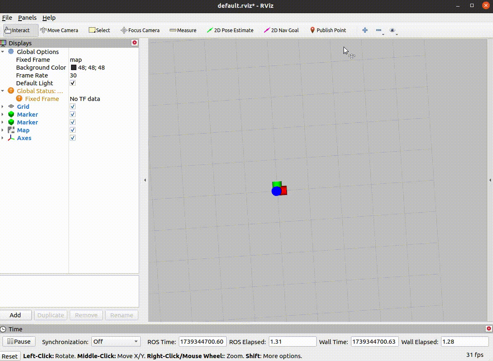
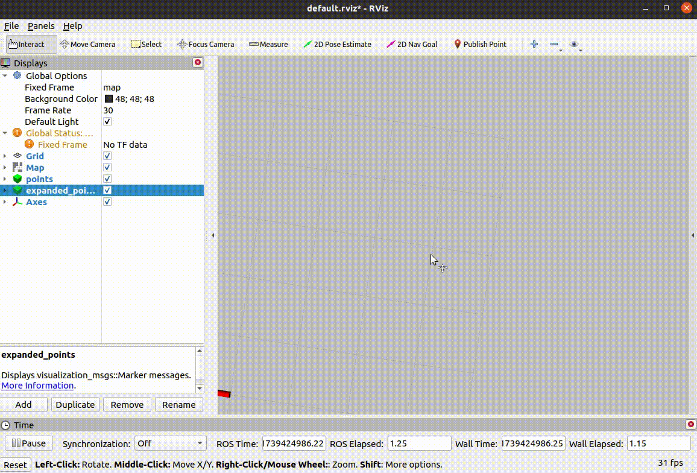

# geometry

**geometry** 集合了几何多边形操作方法。
<p align="center">
  
  
</p>

## 目录
* [依赖](#1-依赖)
* [编译](#2-编译)
* [运行](#3-运行)

## 1. 依赖
工程依赖clipper2。很抱歉，由于本人对CMakelists的依赖管理认知有限，请先单独编译thirdlibs目录中的Clipper2。
执行如下指令，Clipper2编译生成的动态库被指定安装至Clipper2/CPP/install目录中。
```
cd ros1_utils/src/geometry/thirdlibs/Clipper2/CPP
rm -rf install/* build/*
cd build
cmake ..
make -j12 && make install
```

## 2. 编译
```
cd ros1_utils
catkin_make install -DCMAKE_BUILD_TYPE=Release
```

## 3. 运行
```
source install/setup.bash
roslaunch geometry default.launch
```